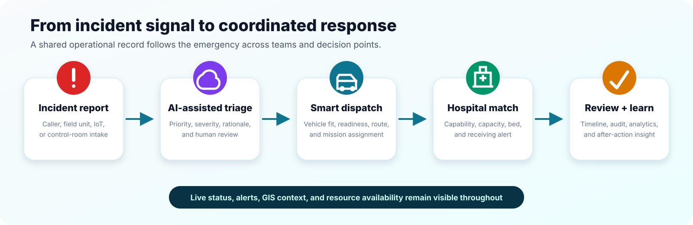
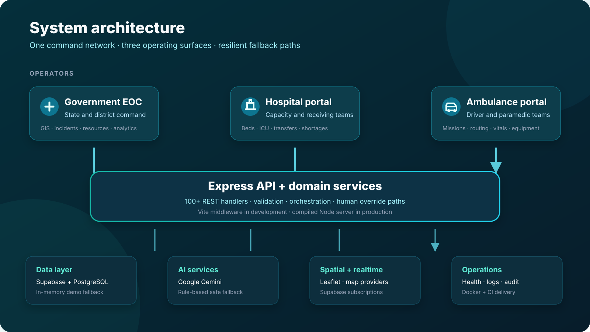

<div align="center">


# Rakshak AI

### Emergency Triage & Hospital Command System

A multi-portal emergency operations platform for incident triage, hospital capacity coordination, ambulance dispatch, disaster command, and statewide operational intelligence.

[](https://github.com/mohithadap-dotcom/Emergency-Triage-Hospital-Command-System/actions/workflows/ci.yml)
[](https://react.dev/)
[](https://www.typescriptlang.org/)
[](https://expressjs.com/)
[](https://supabase.com/)
[](https://ai.google.dev/)

[Overview](#overview) · [Capabilities](#core-capabilities) · [Architecture](#architecture) · [Quick start](#quick-start) · [Configuration](#configuration) · [API](#api-overview)

</div>

> [!IMPORTANT]
> Rakshak AI is an independent software prototype and demonstration environment. It is not an official Government of Maharashtra service, a certified medical device, or a substitute for trained clinical and emergency-response personnel.

## Overview

Rakshak AI brings the main participants in an emergency-response network into one operational picture. A state command team can see incidents, risk, hospital readiness, ICU availability, and ambulance status; hospitals can manage beds and inbound demand; ambulance teams can follow missions and share field updates; and disaster coordinators can activate an Incident Command System workflow.

The repository is designed to be useful in two modes:

- **Zero-configuration demo:** realistic Maharashtra emergency data and rule-based AI fallbacks let the application run without external services.
- **Connected deployment:** Supabase/PostgreSQL persistence, Supabase Realtime, and Google Gemini can be enabled through environment variables.

## Why this project exists

Emergency response often depends on information split across dispatch desks, hospitals, field teams, and district control rooms. Rakshak AI explores a unified workflow in which one incident can move from intake to AI-assisted triage, ambulance assignment, hospital selection, bed reservation, transport, and operational review without losing context between teams.

## Core capabilities

| Area | What the platform provides |
| --- | --- |
| State command | Statewide KPIs, district readiness, active alerts, GIS operations, live incident queues, role-based views, and system health |
| AI-assisted triage | Severity and priority assessment, department and ambulance suggestions, explainable rationale, confidence scoring, and mandatory human-review flags |
| Hospital coordination | Bed matrix, ICU and ventilator tracking, time-bound reservations, emergency queues, resource shortages, hospital comparison, and inter-hospital transfers |
| Ambulance operations | Fleet readiness, mission lifecycle, GPS updates, routing, vehicle health, equipment checks, patient vitals, communications, and driver/paramedic workspaces |
| Disaster command | Disaster-mode activation, ICS roles, mass-casualty triage, surge management, field hospitals, resource matrix, broadcasts, command chat, and after-action timelines |
| Operational intelligence | Demand forecasts, deterioration alerts, disease-cluster signals, district risk, resource optimization, simulations, and command recommendations |
| Reliability and governance | Health telemetry, audit-oriented event trails, fallback data, acknowledged alerts, and human override paths |

### Three coordinated operating surfaces

1. **Government EOC** — the cross-district command view for incidents, GIS, resources, hospitals, fleet, analytics, AI intelligence, administration, and observability.
2. **Hospital portal** — the receiving-facility view for capacity, beds, ICU, equipment, staff, emergency queues, transfers, analytics, notifications, and settings.
3. **Ambulance portal** — the field-operations view for active missions, navigation, vitals, equipment, vehicle health, communication, history, analytics, and AI assistance.

## Operational flow



Every AI recommendation is intended to support — not replace — human decision-making. The current implementation marks clinical AI output for human review and includes deterministic fallback logic when Gemini is not configured or unavailable.

## Architecture



### Technology stack

| Layer | Technologies |
| --- | --- |
| Front end | React 19, TypeScript, Vite, Tailwind CSS 4, Motion, Lucide icons, Recharts |
| Mapping | Leaflet with map tiles; optional Google Maps platform key |
| API | Express 4 with TypeScript and JSON REST endpoints |
| AI | Google Gemini through `@google/genai`, with rule-based fallback paths |
| Data | Supabase client, PostgreSQL, 48-table migration, seed data, and in-memory demo stores |
| Realtime | Supabase Realtime subscriptions for incidents, beds, and ambulances |
| Delivery | Node.js production bundle, Docker Compose, and GitHub Actions CI |

The Express server exposes more than 100 route handlers across incident management, fleet operations, hospital coordination, predictive intelligence, IoT telemetry, messaging, and disaster command.

## Quick start

### Prerequisites

- Node.js 20 or newer
- npm 10 or newer
- Optional: a Supabase project and Google Gemini API key

### Run the demo locally

```bash
git clone https://github.com/mohithadap-dotcom/Emergency-Triage-Hospital-Command-System.git
cd Emergency-Triage-Hospital-Command-System
npm install
npm run dev
```

Open [http://localhost:3000](http://localhost:3000). The demo works without credentials by using the included mock datasets and AI fallback logic.

### Enable connected services

```bash
cp .env.example .env
```

Add the required values to `.env`, then restart `npm run dev`. On Windows PowerShell, use `Copy-Item .env.example .env` instead of `cp`.

### Production build

```bash
npm run check
npm start
```

`npm run check` performs the TypeScript validation and production build. `npm start` serves the generated application from `dist/` on port `3000`.

### Docker Compose

```bash
docker compose up --build
```

This starts the application, PostgreSQL, and Redis-compatible local infrastructure. The application is available at [http://localhost:3000](http://localhost:3000).

## Configuration

| Variable | Required | Purpose |
| --- | --- | --- |
| `GEMINI_API_KEY` | No | Enables Gemini-backed triage, recommendations, and command assistance |
| `VITE_SUPABASE_URL` | For Supabase | Public Supabase project URL used by the browser client |
| `VITE_SUPABASE_ANON_KEY` | For Supabase | Supabase anonymous client key |
| `SUPABASE_SERVICE_ROLE_KEY` | Server features only | Elevated server-side Supabase access; never expose this value to the browser |
| `DATABASE_URL` | For persistence | PostgreSQL connection string used by the server and migration scripts |
| `GOOGLE_MAPS_PLATFORM_KEY` | No | Enables Google Maps-backed views where configured |
| `REDIS_URL` | No | Reserved broker/cache endpoint for connected deployments |
| `STATE_EOC_DISTRICT` | No | Default EOC scope; defaults to `STATE_CONTROL` |
| `DEFAULT_DISASTER_MODE` | No | Startup mode: `NORMAL`, `ALERT`, or `RED_ALERT` |

Never commit `.env`, database passwords, service-role keys, or API keys. The repository ignores all `.env*` files except `.env.example`.

## Database setup

The migration models states, districts, users, roles, hospitals, beds, ICU resources, ambulances, staff, incidents, victims, transfers, reservations, inventories, AI predictions, telemetry, notifications, disaster events, and audit data.

```bash
# Set DATABASE_URL in .env first
npm run db:migrate

# Optional larger Maharashtra demonstration dataset
npm run db:seed
```

The migration and seed files are located in [`supabase/`](supabase/). Review the prototype Row Level Security policies before any public or production deployment; the included policies prioritize demonstration access, not production authorization.

## API overview

| Domain | Representative endpoints |
| --- | --- |
| Platform | `GET /api/health`, `GET /api/summary`, `GET /api/system/observability` |
| Incidents and triage | `GET /api/emergencies`, `POST /api/incidents`, `POST /api/ai-triage`, `POST /api/mass-casualty/batch` |
| Hospitals | `GET /api/hospitals`, `GET /api/beds`, `POST /api/reservations`, `POST /api/transfers` |
| Fleet | `GET /api/fleet`, `POST /api/fleet/dispatch/recommend`, `POST /api/fleet/dispatch/assign`, `POST /api/fleet/routing` |
| Intelligence | `GET /api/intelligence/summary`, `GET /api/ai/district-risk`, `POST /api/ai/simulation` |
| Coordination | `GET /api/coordination/network-summary`, `POST /api/coordination/diversion-check`, `POST /api/coordination/ai-optimize` |
| Disaster command | `POST /api/disaster/create`, `POST /api/disaster/victims/triage`, `POST /api/disaster/ai-commander` |

Routes that change operational state accept JSON request bodies. See [`server.ts`](server.ts) for the full endpoint contract and validation behavior.

## Project structure

```text
.
├── .github/workflows/       # Continuous integration
├── docs/assets/             # README artwork and architecture diagrams
├── scripts/                 # Database migration and seed utilities
├── src/
│   ├── components/          # EOC, hospital, ambulance, disaster, and AI views
│   ├── data/                # Demonstration datasets
│   ├── lib/                 # Supabase and data-service integration
│   ├── App.tsx              # Portal orchestration and client state
│   └── types.ts             # Shared domain model
├── supabase/                # PostgreSQL migration and seed SQL
├── server.ts                # Express API and production web server
├── Dockerfile
└── docker-compose.yml
```

## Available scripts

| Command | Description |
| --- | --- |
| `npm run dev` | Start Express and Vite in development mode |
| `npm run lint` | Run TypeScript validation without emitting files |
| `npm run build` | Build the browser bundle and server bundle |
| `npm run check` | Run lint and build together |
| `npm start` | Start the compiled production server |
| `npm run preview` | Preview the Vite client bundle |
| `npm run db:migrate` | Apply the PostgreSQL/Supabase schema and base seed |
| `npm run db:seed` | Load the extended Maharashtra demo dataset |
| `npm run clean` | Remove generated build output |

## Current scope and limitations

- Authentication screens and role profiles are demonstration implementations; production identity-provider integration is still required.
- Several workflows use in-memory stores when a database is not configured, so demo changes reset when the server restarts.
- The included RLS policies are permissive for demonstration use and must be replaced with organization-specific authorization rules.
- AI output can be incomplete or incorrect. Clinical and dispatch decisions require qualified human review.
- Redis is provisioned by Docker Compose as future-ready local infrastructure; the current server does not depend on it for core demo behavior.

## Roadmap

- Production-grade authentication, tenant isolation, and least-privilege RLS
- Durable queues and event-driven coordination between EOC, hospitals, and ambulances
- OpenAPI documentation and contract tests for the REST API
- Automated unit, integration, accessibility, and end-to-end test suites
- FHIR/HL7-compatible clinical interoperability adapters
- Offline-first field workflows and resilient network synchronization
- Deployment guides, monitoring dashboards, and disaster-recovery runbooks

## Contributing

Contributions are welcome. Read [CONTRIBUTING.md](CONTRIBUTING.md) for the local workflow, quality checks, and healthcare-safety expectations. For vulnerabilities, follow [SECURITY.md](SECURITY.md) and do not disclose sensitive findings in a public issue.

## Responsible use

This project contains fictional demonstration records. Do not enter real patient data, protected health information, access credentials, or live emergency details into an unsecured development deployment. Any real-world deployment requires clinical governance, security review, privacy assessment, regulatory analysis, reliability engineering, and integration testing with the responsible authorities.

---

<div align="center">
Built as a technical prototype for faster, clearer coordination across emergency-response teams.
</div>
